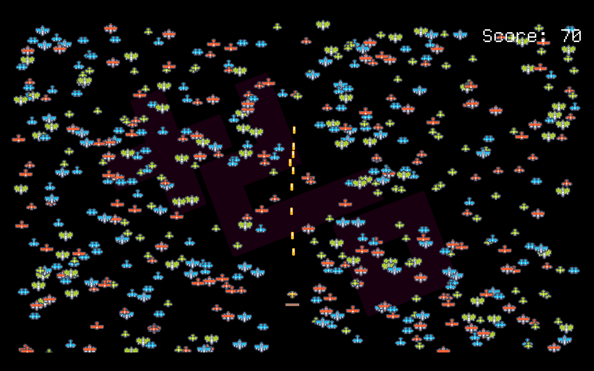

# Tiny Micro Shmup

A tiny micro game where the player shoots things with a plane, trying to avoid
a constant stream of angry planes and their shots.

- Score is based on ???
- Health is shown ??? and slowly replenishes over time

## Libraries and assets

This game is made with the [orx game engine](https://orx-project.org) and uses
assets from [Kenney](https://kenney.nl).

## Licenses

### Game

This game is distributed under the [zlib license](LICENSE), the same license as
orx.
